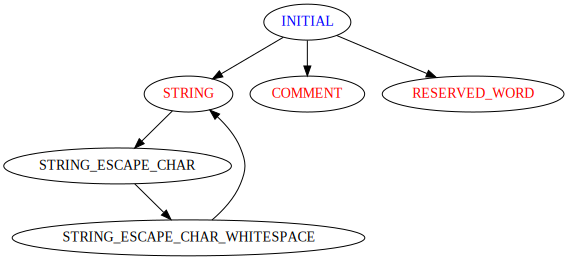

# Lex



Start from blue, end at end.

## String

Since the parsed token size is different from the origin token, `Scanner.string_buf_` is used to save the string token.

### Escape Character

`\t`, `\n`, `\\` are handled inline.

`\{WHITESPACE}\` is handled inside `STRING_ESCAPE_CHAR_WHITESPACE` condition.

## Comment

Tiger language support nested comment. `Scanner.comment_level_` will store the current comment level.

## Error

error message is printed in following format.

```bash
${FILE_NAME}:${LINE}.${COLUMN}: ${MESSAGE_LEVEL}: ${MESSAGE}
```

## EOF

At end-of-file, unmatched `""` and unmatched `\**\` will throw `unexpected EOF`.
